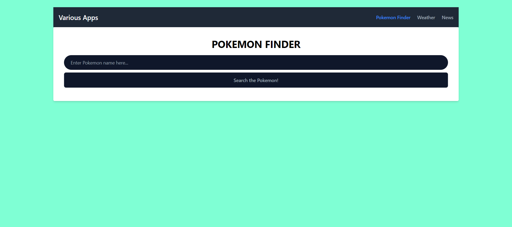
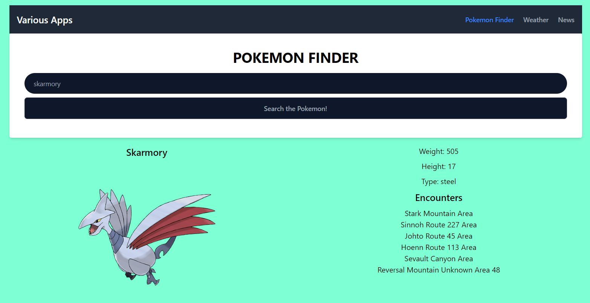

# POKEMON FINDER APP

## YOU CAN VISIT THE WEBSITE [HERE](https://pokemon-finder-app-one.vercel.app/)

## OVERVIEW

### WEBSITE UI

- Website homepage with simple search bar
  

- Search result
  

### TECH STACK

- Typescript
- React

### STYLING

- Tailwind CSS
- Preline UI

### FEATURES

- Searching Pokemon from 

### GETTING STARTED

To get started with this project, here's what you can do:

1. Clone the repository

```
git clone https://github.com/mahdiharish/pokemon-finder-app.git
```

2. Navigate the project folder

```
cd w3-revou-next
```

3. Install dependencies

```
pnpm install
```

or

```
yarn install
```

4. Run development server

```
pnpm run dev
```

5. Open browser then go to

```
http://localhost:5173
```

### FURTHER IMPROVEMENTS

- Develop the website using React Native, as the sprite images has low-resolution
- Show Pokemon details
